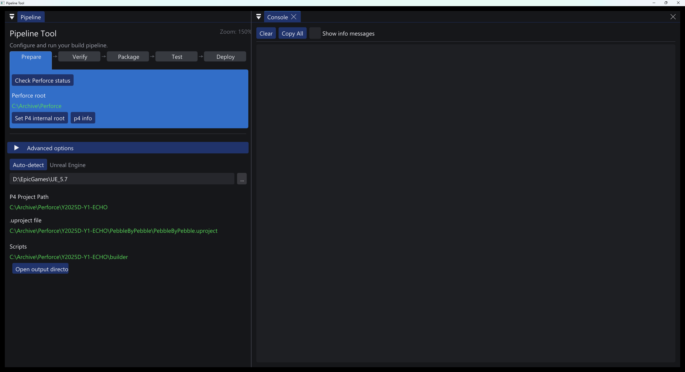
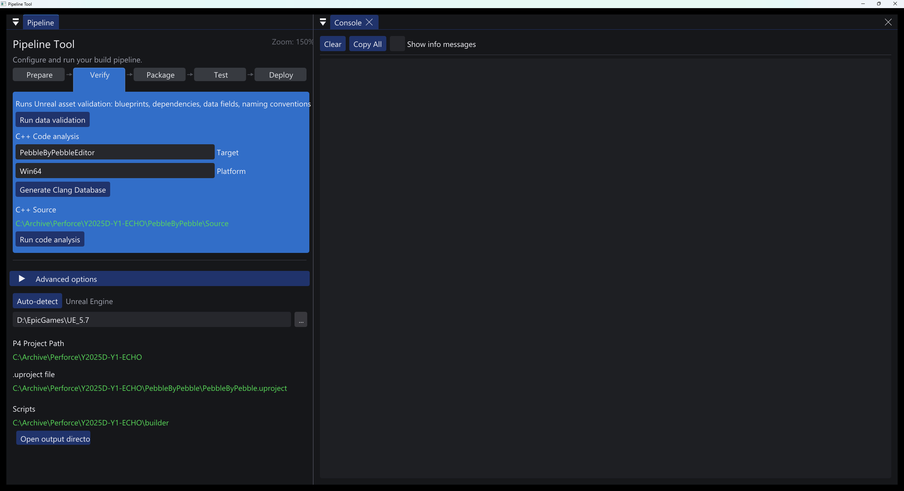
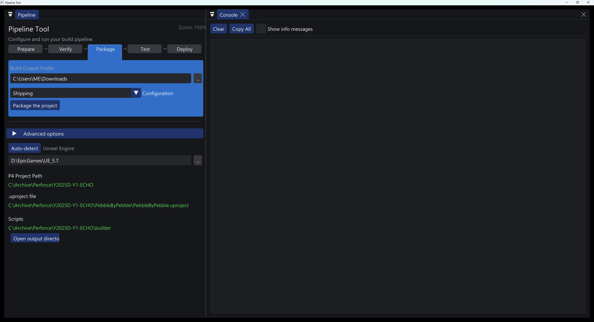
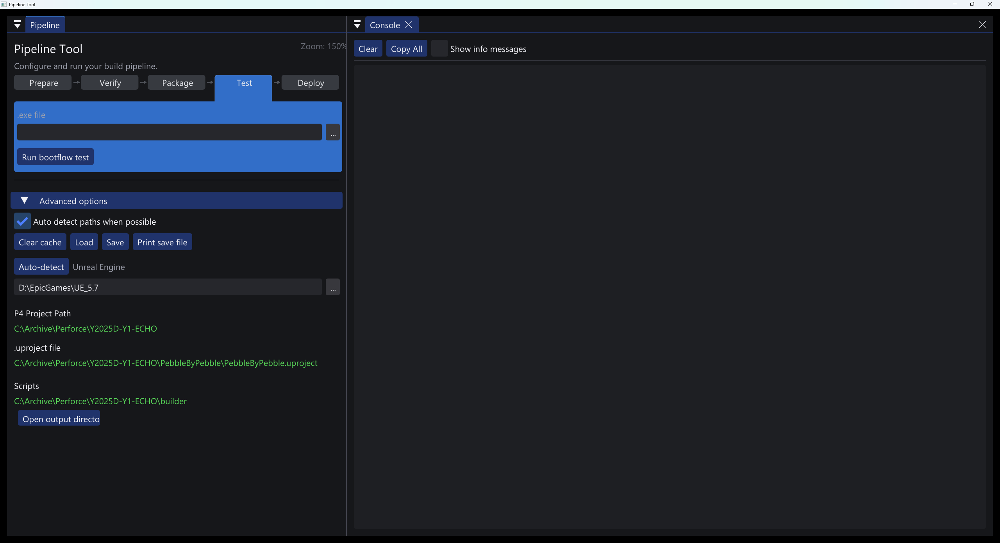
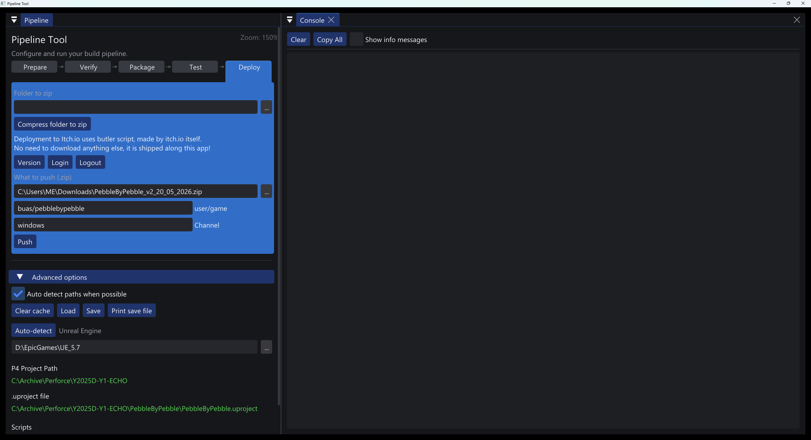
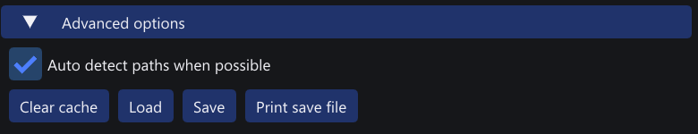
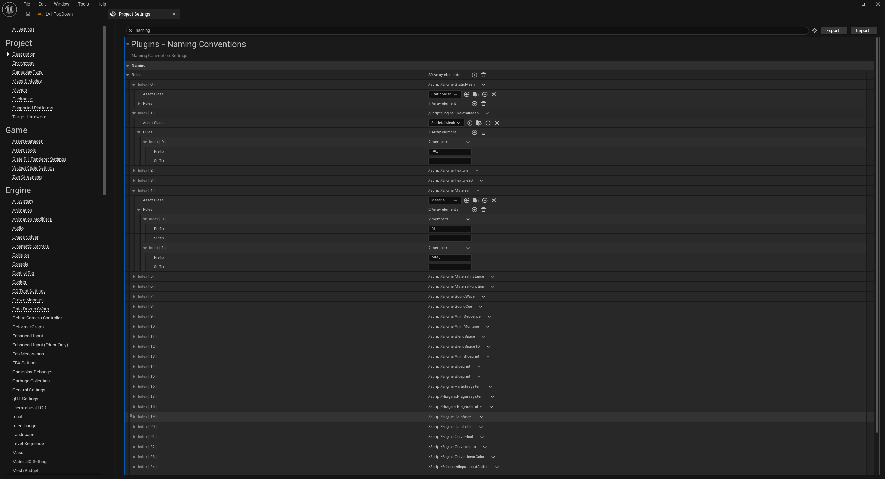
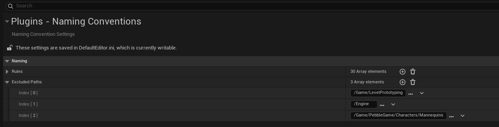

# Lighweight Unreal Engine Building Pipeline

This is my BUas CMGT (IGAD) Year 1 Block D research project : automated building pipeline.

## Product

The product consists of several parts:
1. GUI application. A single windows executable
2. A set of powershell auxiliary scripts that the GUI application runs
3. An Unreal Engine 5.7 plugin for naming validation

All of it runs locally on your machine, giving you better control but also drawing resources and time. Very lightweight, integrates with (but doesn't require) [Perforce](https://www.perforce.com/ "Perforce official website").

Written in C++ for Windows, mostly for Unreal Engine (5.7)

As of the time writing this, the entire app is less than 900KB with no special external dependencies. If you have Perforce and Unreal already, you should not need to install/setup anything else.

Has hardcoded path derivation patterns, requiring the following project structure:

\- `(-1)` Perforce workspace root/\
\-- `(0)` project/\
\----- `(1)` builder/\
\---------- `(2)` **editor.exe**\
\---------- `(2)` butler/\
\---------- `(2)` *powershell scripts*\
\---------- `(2)` *temporary files*\
\----- `(1)` unreal project/\
\-------- `(2)` **unreal_project.uproject**

Names and absolute paths are irrelevant to the algorithm, only the relative structure. If it is followed, all paths will be automatically detected and filled in. Otherwise, you can use GUI (preferrably) or manually edit the `builder/pipeline_settings.json` to enter those paths.

Run the editor.exe from the specified place. Path derivation works by getting the directory of the running executable, so if you want autoderivation work, follow the structure.

Pipeline settings are automatically generated from the GUI and saved in the mentioned `pipeline_settings.json` file near the executable. It is a per-machine cache file which is useful to avoid reentering details every time, but do not share it in a version control system (it will most likely not work for others' paths and settings).

## Stages of the pipeline

### 1: Prepare

Checks if Perforce exists, if paths are valid, if there are no uncommitted (checked out) files, if you are behind the server.

If commands don't work, either paths are invalid, or P4 CLI isn't setup correctly. To fix this, click `Set P4 internal root`.

More info about the Perforce setup, workspace, user and project status can be seen using `p4 info` button.

>requires: perforce



### 2: Verify

Runs Unreal Engine data (asset) validation, which checks links and references. It also runs my custom naming validator, which is fully tweakable via Project Settings in the Unreal Editor.

It runs Clang-tidy static code analyzer with predefined but customizable options in `.clang-tidy`. Can generate `compile_commands.json` for Unreal.

>requires: unreal engine &| clang-tidy



### 3: Package

Runs [Unreal Automation Tool (UAT)](https://dev.epicgames.com/documentation/unreal-engine/unreal-automation-tool-overview-for-unreal-engine "Epic Games overview of UAT") BuildCookRun command, which cooks assets and maps, compresses everything, builds, compiles and finally produces a final executable along with auxiliary files.

>requires: unreal engine



### 4: Test

Runs automatic bootflow test* which runs the game and waits until it receives a message that the engine and/or the game has booted. It then exits and prints to console.

To test an executable, select it and click `Run bootflow test`.

*- only works on Development/Debug builds

>requires: unreal engine



### 5: Deploy

It deploys to the specified itch.io page using [butler](https://itch.io/docs/butler/). Generally it's faster and allows for bigger throughputs than normal itch.io website GUI, according to their documentation.

You need to login if you want to deploy to itch.io. It is as simple as clicking `Login`, which will take you to a browser where you need to authenticate butler. That's it!. You can always log out using `Logout` button.

It also allows to archive (zip) a directory without leaving the app. Does exactly the same as the normal windows zip function does. Entirely optional to use.

butler is shipped locally with the program (`scripts/butler`). It is of version `v15.26.1, built on Feb 26 2026` (can be checked via `Deploy` -> `version`)

>requires: -



### Advanced options

Allows to toggle auto path detection, clear/load/save/print the cache file (`pipeline_settings.json`).



## Naming Convention Validator

It is an Unreal plugin that exposes naming rules into the project settings. As seen on the image, you can customize prefix and suffix for each rule, and each type (like Material and SkeletalMesh) can have many rules, if needed. For example, a Blueprint can be prefixed with BP_ or WBP_, depending on use, like a Material can be M_ or MM_, depending on the purpose or "type" of the material.

Default rules are hardcoded according to the [conventions recommended by Epic](https://dev.epicgames.com/documentation/unreal-engine/recommended-asset-naming-conventions-in-unreal-engine-projects?lang=en-US).



As per request of designers, I also added path excludes to disable the validator on certain paths, like default template contents, engine assets or test/prototyping folders.




### How to use it?

Two ways:
 - Open my pipeline app, go to `Verify` stage, click `Run Data Validation`. It will launch the validation on everything, according to the saved rules
 - In Unreal Editor right click any folder you want to validate all assets in, and click (in the context menu at the very bottom) `Validate Assets`. It does the same.

Just like all other project settings, naming rules are saved in `DefaultEditor.ini`

## Building the app

Dependencies (provided directly or fetched with cmake):
- GLFW  (for window and rendering)
- glad  (for OpenGL)
- imgui (for GUI)
- json  (for exporing/importing settings)
- stb_image (?)

Clone it
```sh
git clone https://github.com/AnanasikDev/UEPipeline.git
```

go into the folder

```sh
cd UEPipeline
```

### Option 1 : using Visual Studio

Open in Visual Studio, go to the topmost CMakeLists.txt and in Visual Studio click Generate Cache. You might need to install CMake tools extension for Visual Studio. Then select editor.exe as the target and run it.

### Option 2 : using Visual Studio Code

Similarly to Visual Studio, it is easy to build the app in VSCode, albeit more initial setup may be required, such as installing `CMake Tools` extension and setting it up (this is not a guide about VSCode, and there are plenty online). Then just open palette (`Ctrl` + `Shift` + `P` by default), `CMake Configure`. Wait until the project files are generated, then go to `CMake Build` and run.

### Option 3 : using CMake manually

Generate files

```sh
cmake -S . -B build
```

Build

```sh
cmake --build build
```

### Note:

Then in `out/ship` is the editor.exe

It will also automatically copy the file into the Perforce workspace which is normally where you want to use it from.

> [!IMPORTANT]
> As of the time of writing this manual, it is a known issue that the path for the copy is hardcoded in CMakeLists.txt. This will be resolved in future.

## Reflection & future

The project was built in under 5 weeks with minimal prior knowledge of Unreal Engine, automated building, powershell scripting and windows architecture. It was a challenge and I am happy with the result.

I researched CI/CD in software development and compared it to the game industry, revealing the sheer difference in mindsets and approaches between the two. Automatic testing and building seems to be far less used for games than it is for other kinds of software. Unreal Engine in particular provides this functionality out of the box or in a form of external plugins, but most of them target large-scale projects by making use of build farms. For this project and research, my goal was to develop a local lightweight alternative to provide necessary toolings to simplify integration and delivery without introducing too much architectural complexity. I think I have fully achieved this.

If the time allows, I would also like to implement (to some degree) the following:

[ ] Integration testing, select which tests to run, get quick results and errors\
[ ] More robust bootflow test, that would also work in Shipping mode\
[ ] Choose which maps to cook, option to cook one map at a time to test leaking dependencies or other issues\
[ ] Add more customization of BuildCookRun\
[ ] Allow to run other Unreal Automation commands\
[ ] Add more automations to path detection to make it closer to a one-button pipeline (remember last/all build directories)\
[ ] Make console more intuitive with wrapping text, better coloring, and fluent text selection + fix autoscrolling\
[ ] Make better use of data-oriented design to maximize flexibility and customization\
[ ] Make clang-tidy and other subsystems fully and intuitively customizable from GUI\
[ ] Make fully and easily buildable with clang/gcc without VS + make CMake more flexibly (**remove copy-to path hardcoding**)\

## Questions?

Hit me up on Discord `#ananaseek`, [find an existing issue](https://github.com/AnanasikDev/UEPipeline/issues) or [create a new issue](https://github.com/AnanasikDev/UEPipeline/issues/new) on github.